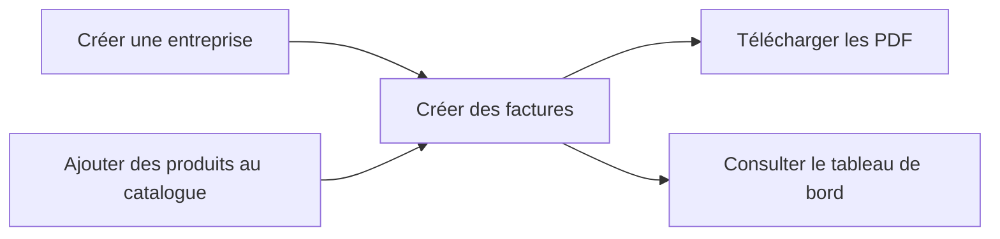
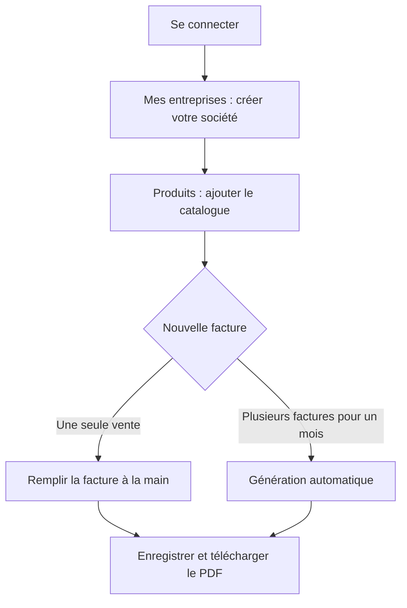
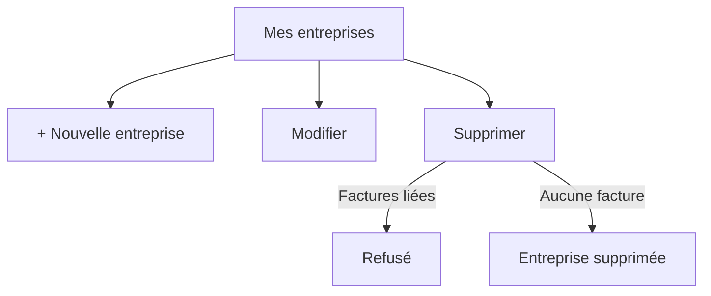
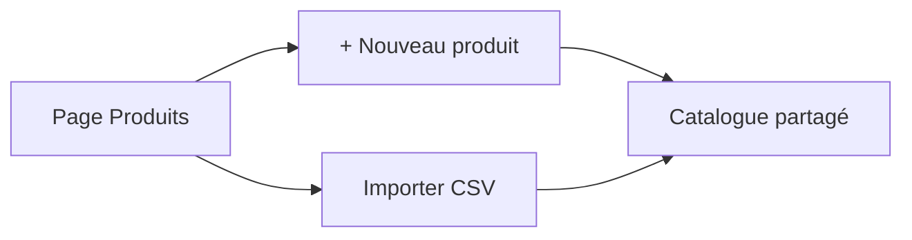
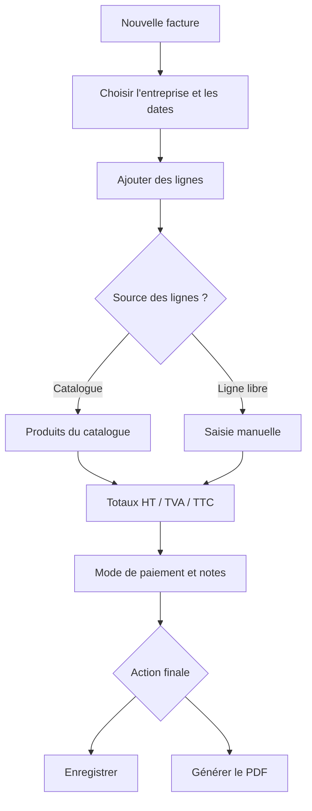
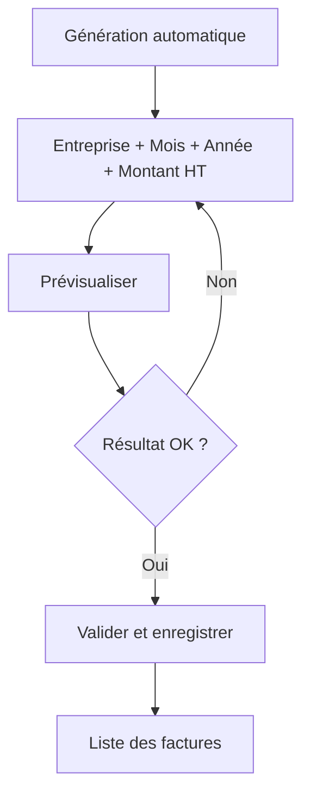
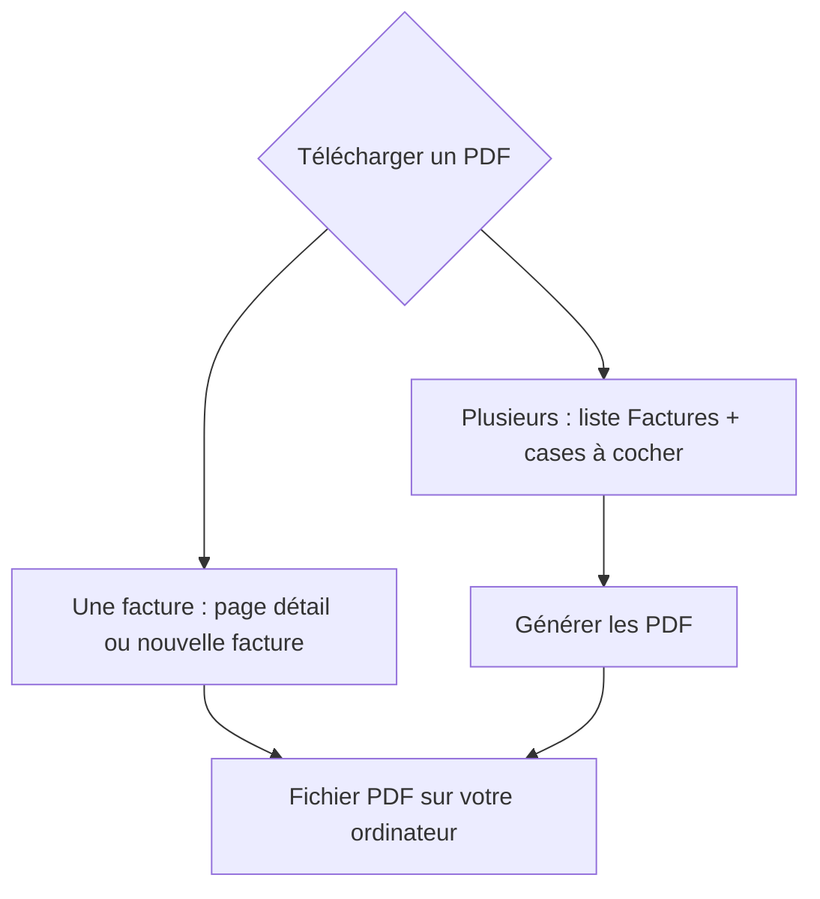
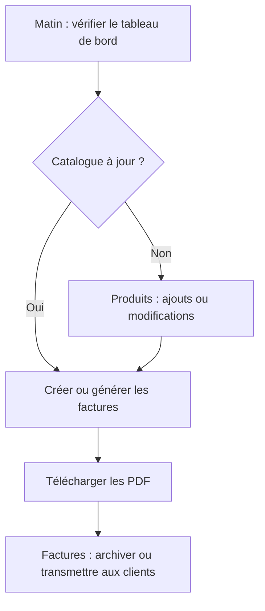

# Guide utilisateur — Facturation

Ce guide explique comment utiliser l’application au quotidien : créer des entreprises, gérer vos produits, émettre des factures et suivre vos ventes.

Les montants sont en **Ariary (Ar)**. Les factures affichent les totaux **HT** (hors taxes), la **TVA** et le **TTC** (toutes taxes comprises).

---

## Sommaire

1. [Vue d’ensemble](#1-vue-densemble)
2. [Première utilisation](#2-première-utilisation)
3. [Se connecter et naviguer](#3-se-connecter-et-naviguer)
4. [Gérer vos entreprises](#4-gérer-vos-entreprises)
5. [Gérer vos produits](#5-gérer-vos-produits)
6. [Créer une facture à la main](#6-créer-une-facture-à-la-main)
7. [Générer des factures automatiquement](#7-générer-des-factures-automatiquement)
8. [Consulter et gérer vos factures](#8-consulter-et-gérer-vos-factures)
9. [Télécharger les PDF](#9-télécharger-les-pdf)
10. [Tableau de bord et statistiques](#10-tableau-de-bord-et-statistiques)
11. [Cas particuliers et bonnes pratiques](#11-cas-particuliers-et-bonnes-pratiques)

---

## 1. Vue d’ensemble

L’application s’organise autour de **trois éléments** :

| Élément | Rôle |
|--------|------|
| **Entreprise** | C’est vous (votre société). Elle apparaît en en-tête de la facture : nom, adresse, NIF, STAT, activité, taux de TVA. |
| **Produits** | Votre catalogue de vente **unique**, partagé par toutes vos entreprises. |
| **Factures** | Les documents de vente, liés à **une entreprise** et composés de **lignes** (produits ou texte libre). |



**Point important :** le catalogue produits est **le même pour toutes vos entreprises**. Seule la facture change d’émetteur (en-tête et taux de TVA) selon l’entreprise choisie.

---

## 2. Première utilisation

Voici le parcours recommandé la **toute première fois** :



### Étapes détaillées

1. **Connectez-vous** avec votre identifiant et mot de passe.
2. Allez dans **Mes entreprises** et créez votre société (nom obligatoire ; le reste peut être complété plus tard).
3. Allez dans **Produits**, puis :
   - créez vos produits un par un, **ou**
   - importez un fichier CSV (voir section 5).
4. Allez dans **Nouvelle facture** pour émettre votre première facture.

> Tant qu’aucune entreprise n’existe, vous ne pourrez pas créer de factures. L’application vous le rappellera.

---

## 3. Se connecter et naviguer

### Connexion

- Ouvrez l’application et saisissez votre **email** et **mot de passe**.
- Cliquez sur **Se connecter**.
- Pour quitter, utilisez **Déconnexion** en haut à droite.

### Menu principal

| Menu | À quoi ça sert |
|------|----------------|
| **Accueil** | Tableau de bord : chiffres du mois, de l’année, graphiques. |
| **Factures** | Liste de toutes vos factures, filtres, téléchargement groupé de PDF. |
| **Nouvelle facture** | Créer une facture manuellement ou lancer la génération automatique. |
| **Produits** | Catalogue unique : ajout, modification, import CSV. |
| **Mes entreprises** | Créer et modifier vos sociétés émettrices. |
| **Aide** | Ce guide utilisateur, accessible à tout moment. |

---

## 4. Gérer vos entreprises

**Chemin :** menu **Mes entreprises**

### Créer une entreprise

1. Cliquez sur **+ Nouvelle entreprise**.
2. Remplissez le formulaire :
   - **Nom** *(obligatoire)* — ex. « Ma Société SARL »
   - **Adresse** — apparaît sur la facture
   - **Activité** — ex. « Commerce de détail »
   - **NIF** et **STAT** — identifiants fiscaux
   - **Taux de TVA** — par défaut 20 % ; utilisé pour toutes les factures de cette entreprise
3. Cliquez sur **Enregistrer**.

### Modifier une entreprise

1. Dans la liste, cliquez sur **Modifier** sur la ligne concernée.
2. Changez les informations souhaitées.
3. Enregistrez.

Les factures **déjà créées** conservent leurs montants ; les **nouvelles** factures utiliseront le taux de TVA à jour.

### Supprimer une entreprise

1. Cliquez sur **Supprimer**.
2. Confirmez.

**Impossible de supprimer** une entreprise si des **factures** y sont encore rattachées.



---

## 5. Gérer vos produits

**Chemin :** menu **Produits**

Le catalogue est **unique** : les mêmes produits sont disponibles quelle que soit l’entreprise choisie lors de la facturation.

### Ajouter un produit manuellement

1. Cliquez sur **+ Nouveau produit**.
3. Saisissez :
   - **Désignation** — nom du produit ou du service
   - **Prix unitaire HT** — prix hors taxes
4. Cliquez sur **Créer**.

### Modifier ou supprimer un produit

- **Modifier** : change la désignation ou le prix. Les factures déjà émises ne sont pas modifiées.
- **Supprimer** : retire le produit du catalogue (récupérable par l’administrateur). Les anciennes factures qui l’utilisaient restent intactes.

### Importer des produits depuis un fichier CSV

Utile pour charger un catalogue complet d’un coup.

1. Cliquez sur **Importer CSV**.
2. Choisissez votre fichier sur votre ordinateur.
3. Cliquez sur **Importer**.

**Format attendu du fichier :**

- Une ligne d’en-tête, puis une ligne par produit.
- Deux colonnes principales :
  - **Libellé** (ou Désignation, Produit, Nom…)
  - **PU** (ou Prix, Prix unitaire…)
- Séparateur accepté : point-virgule `;`, virgule `,` ou tabulation.

**Exemple :**

```
Libelle;PU
Riz parfumé 5 kg;12500
Huile végétale 1 L;8900
Savon de Marseille;3200
```

Un message indique combien de produits ont été importés. Les lignes incorrectes sont signalées sans bloquer tout l’import.



---

## 6. Créer une facture à la main

**Chemin :** menu **Nouvelle facture**

C’est le mode idéal pour **une facture précise**, ligne par ligne.

### Étape 1 — Informations générales

| Champ | Description |
|-------|-------------|
| **Entreprise** | Société émettrice. Détermine l’en-tête du PDF et le taux de TVA. |
| **N° facture** | Proposé automatiquement (ex. FAC-2026-001). Vous pouvez le modifier si besoin. |
| **Date d’émission** | Date de la facture. |
| **Date d’échéance** | Optionnelle. |

> Si vous changez d’**entreprise** en cours de saisie, le **catalogue reste le même** ; seul le **taux de TVA** (et l’en-tête du PDF) est recalculé selon la nouvelle entreprise.

### Étape 2 — Lignes de facturation

Deux façons d’ajouter des lignes :

**A. Depuis le catalogue**
1. Cliquez sur **Choisir depuis le catalogue**.
2. Recherchez et sélectionnez un produit.
3. Le produit est ajouté avec quantité 1 et son prix catalogue. Ajustez quantité et prix si nécessaire.

**B. Ligne libre**
1. Cliquez sur **+ Ligne libre**.
2. Saisissez vous-même la désignation, la quantité et le prix HT.

Pour chaque ligne, vous voyez le détail **HT**, **TVA** et **TTC**. Les totaux généraux se mettent à jour en bas.

Pour retirer une ligne, cliquez sur **Supprimer** à droite de celle-ci.

### Étape 3 — Compléments

- **Mode de paiement** — ex. « AU COMPTANT » (valeur par défaut).
- **Notes** — texte libre optionnel.

### Étape 4 — Enregistrer ou obtenir le PDF

| Bouton | Action |
|--------|--------|
| **Enregistrer la facture** | Sauvegarde la facture et ouvre sa page de détail. |
| **Générer le PDF** | Enregistre si nécessaire, puis télécharge le PDF dans votre navigateur. |



---

## 7. Générer des factures automatiquement

**Chemin :** menu **Nouvelle facture** → bouton **Génération automatique**

Ce mode sert à **créer plusieurs factures d’un coup** pour un mois donné, en visant un **montant total HT** que vous indiquez. L’application répartit les ventes sur vos produits du catalogue.

### Quand l’utiliser ?

- Vous connaissez le **chiffre d’affaires HT du mois** et souhaitez générer les factures correspondantes rapidement.
- Vous avez déjà **importé votre catalogue produits**.

### Étapes

1. Cliquez sur **Génération automatique** (en haut à droite de la page Nouvelle facture).
2. Remplissez :
   - **Entreprise** — société émettrice de ces factures
   - **Mois** et **Année**
   - **Montant HT total** — le total visé pour le mois (ex. `23 315 200`)
3. Cliquez sur **Prévisualiser**.
4. Consultez le résumé :
   - nombre de factures générées ;
   - total HT obtenu ;
   - liste des factures avec date, nombre de lignes et montant.
5. Cliquez sur **+** sur une ligne pour voir le détail des produits et quantités.
6. Si le résultat vous convient, cliquez sur **Valider et enregistrer**.

Les factures sont créées et vous êtes redirigé vers la liste des factures.



### Points à retenir

- Le **catalogue produits commun** est utilisé pour toutes les entreprises.
- Si le catalogue est vide, un message vous invite à en ajouter via **Produits**.
- Vous pouvez **Modifier les paramètres** pour relancer une prévisualisation sans enregistrer.

---

## 8. Consulter et gérer vos factures

**Chemin :** menu **Factures**

### Filtrer la liste

Utilisez les champs en haut du tableau :

| Filtre | Effet |
|--------|-------|
| **Entreprise** | Affiche uniquement les factures de la société choisie. Laissez « Toutes les entreprises » pour tout voir. |
| **N° facture** | Recherche partielle (ex. `FAC-2026`) |
| **Du / Au** | Plage de dates d’émission |

Les filtres se **combinent** entre eux : par exemple, vous pouvez afficher les factures de **Société A** entre le **1er janvier** et le **31 mars**.

Les filtres s’appliquent automatiquement quand vous les modifiez. La pagination se remet à la page 1 à chaque changement.

Si vous gérez **plusieurs entreprises**, une colonne **Entreprise** apparaît dans le tableau pour identifier rapidement l’émetteur de chaque facture.

### Ouvrir une facture

Cliquez sur le **numéro de facture** pour voir le détail : dates, lignes, totaux HT/TVA/TTC, mode de paiement, notes.

### Supprimer une facture

Sur la liste ou la page de détail, cliquez sur **Supprimer** et confirmez. La facture disparaît de vos listes, mais n’est pas effacée définitivement.

> **Suppression accidentelle ?** Contactez l’administrateur, qui peut restaurer la facture depuis la page **Administration**.

---

## 9. Télécharger les PDF

Les PDF ne sont **pas stockés** dans l’application : ils sont **générés à la demande** et téléchargés sur votre ordinateur.

### Une seule facture

- **Page de détail** : bouton **Télécharger le PDF**
- **Lors de la création** : bouton **Générer le PDF**

### Plusieurs factures à la fois

1. Allez dans **Factures**.
2. Cochez les factures souhaitées (ou cochez la case en-tête pour **tout sélectionner**).
3. Cliquez sur **Générer les PDF**.
4. Chaque facture est téléchargée l’une après l’autre ; une barre de progression indique l’avancement.

Le PDF reprend les informations de **l’entreprise** liée à la facture (nom, adresse, NIF, STAT, activité) ainsi que toutes les lignes et les totaux.

### Montant en toutes lettres

En bas du PDF, la ligne **« Arrêté à la somme de… »** reprend le **total TTC** en toutes lettres (en ariary).

Ce montant est **arrondi à l’ariary entier le plus proche** avant d’être écrit en lettres. Les centimes ne sont pas mentionnés dans cette phrase.

**Exemple :** un total TTC de **1 234 567,49 Ar** s’affichera numériquement avec les décimales, mais en lettres : *« un million deux cent trente-quatre mille cinq cent soixante-sept ariary »* (arrondi à **1 234 567 Ar**).



---

## 10. Tableau de bord et statistiques

**Chemin :** menu **Accueil**

Le tableau de bord comporte **deux zones**.

### Zone « Année en cours »

Affiche, pour l’année calendaire en cours :

- **Factures ce mois-ci** — nombre de factures du mois en cours
- **Montant HT ce mois** — total HT du mois en cours
- **Montant HT** — total HT depuis le début de l’année
- **Produit le plus vendu** — celui avec la plus grande quantité vendue sur l’année

### Zone « Statistiques » (année sélectionnée)

1. Choisissez une **Année** dans la liste.
2. Consultez :
   - le **montant HT total** de cette année ;
   - le **produit le plus vendu** de l’année ;
   - un **graphique des ventes mensuelles** (montant HT par mois).
3. Optionnel : filtrez par **Produit** pour voir un graphique des **quantités vendues** mois par mois.
4. Cliquez sur **Exporter Excel** pour télécharger les ventes mensuelles de l’année choisie.

Les statistiques s’appuient sur **toutes les factures enregistrées**, quelle que soit l’entreprise émettrice.

---

## 11. Cas particuliers et bonnes pratiques

### Plusieurs entreprises

| Situation | Que faire |
|-----------|-----------|
| Deux sociétés distinctes | Créez **deux entreprises** ; le **catalogue produits reste le même**. |
| Facturer pour la société A | Sur **Nouvelle facture**, sélectionnez l’entreprise A : même catalogue, en-tête et TVA de A. |
| Changer de société en cours de saisie | Les lignes restent ; le **taux de TVA** est recalculé selon la nouvelle entreprise. |

### Numérotation des factures

- Format habituel : **FAC-AAAA-NNN** (année + numéro séquentiel).
- Un numéro vous est **proposé** à l’ouverture de la page Nouvelle facture.
- Chaque numéro doit être **unique**.

### Lignes « Consignation » (génération automatique)

Lors de la génération automatique, si un petit écart subsiste pour atteindre exactement le montant HT visé, une ligne **Consignation** peut être ajoutée. Cela n’altère pas les prix de vos produits dans le catalogue.

### Ordre de travail recommandé au quotidien



### Checklist avant la première facture du mois

- [ ] L’entreprise émettrice est créée et ses coordonnées sont à jour (NIF, STAT, adresse).
- [ ] Le catalogue produits est complet.
- [ ] Le taux de TVA de l’entreprise est correct.
- [ ] La date d’émission est la bonne.
- [ ] Au moins une ligne de facturation est renseignée.

### En cas de message d’erreur courant

| Message | Signification | Solution |
|---------|---------------|----------|
| « Créez d’abord une entreprise » | Aucune société enregistrée | **Mes entreprises** → créer une entreprise |
| « Aucun produit dans le catalogue » | Catalogue vide | **Produits** → ajouter ou importer |
| « Impossible de supprimer : des factures sont liées » | Des factures utilisent cette entreprise | Supprimez ou réaffectez d’abord ces factures |
| Numéro de facture déjà utilisé | Doublon de numérotation | Choisissez un autre numéro |

---

## Récapitulatif des parcours

| Je veux… | Où aller ? |
|----------|------------|
| Créer ma société | **Mes entreprises** |
| Ajouter des produits | **Produits** |
| Facturer une vente précise | **Nouvelle facture** |
| Générer tout un mois de factures | **Nouvelle facture** → **Génération automatique** |
| Retrouver une ancienne facture | **Factures** (filtres entreprise, N° ou dates) |
| Voir les factures d’une seule société | **Factures** → filtre **Entreprise** |
| Télécharger un ou plusieurs PDF | **Factures** (cases à cocher) ou page de détail |
| Voir mes chiffres de vente | **Accueil** (tableau de bord) |

---

*Guide utilisateur — application Facturation*
